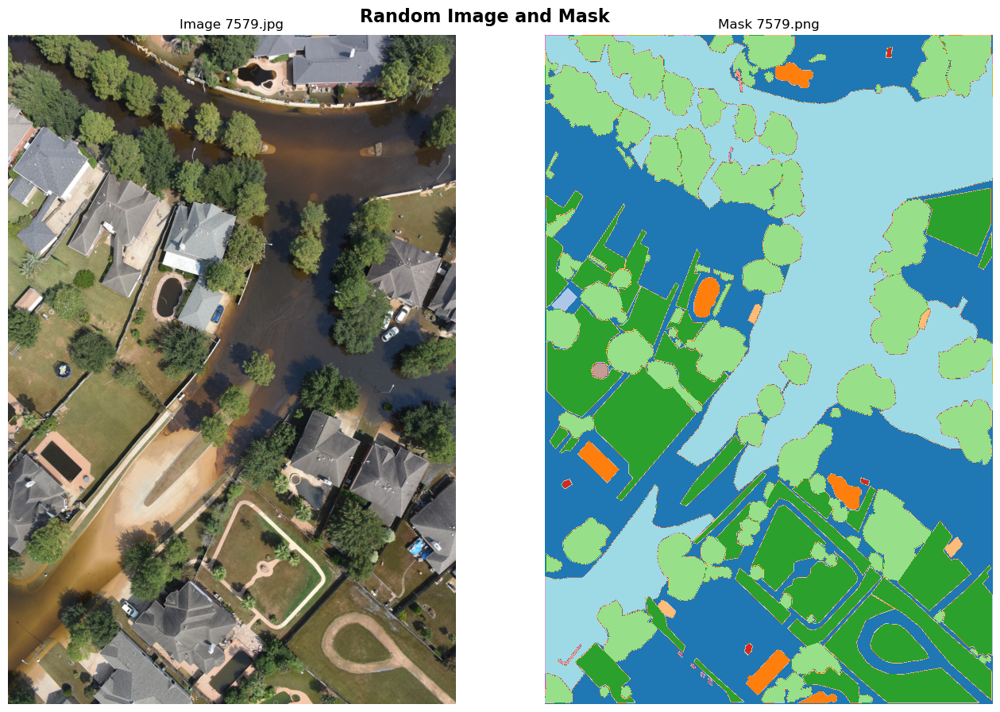
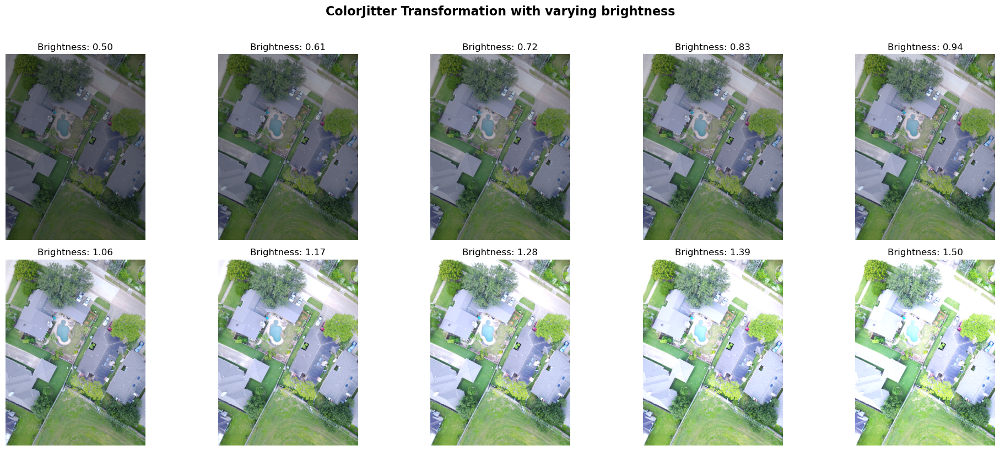
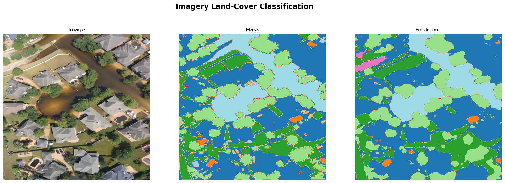

# Landclassiiation for Hurricane Disaster Recovery

## Content
- [Landclassiiation for Hurricane Disaster Recovery](#landclassiiation-for-hurricane-disaster-recovery)
- [Overview](#overview)
- [Motivation](#motivation)
- [Data](#data)
- [Computer Vision Methods](#computer-vision-methods)
- [Results](#results)
- [Authors](#authors)

## Overview
The aim of this work is to produce a high quality semantic segmentation computer vision model
capable of classifying aerial imagery after hurricanes to assist with property damage claims
based on flood loss.

## Motivation
After severe hurricanes, property insurers become overwhelmed with property damage claims,
specifically for flood loss. Being able to remotely evaluate the validity of these claims at a large
scale can greatly increase the turnover time required to distribute insurance proceeds to clients.

## Data
The aerial images used for training come from imagery after Hurricane Harvey. There are 261
images with their associated masks. There are a total of 25 classes in the masks. The classes
are as follows. (0: Background, 1: Property Roof, 2: Secondary Structure, 3: Swimming Pool, 4:
Vehicle, 5: Grass, 6: Trees / Shrub, 7: Solar Panels, 8: Chimney, 9: Street Light, 10: Window, 11:
Satellite Antenna, 12: Garbage Bins, 13: Trampoline, 14: Road/Highway, 15: Under
Construction / In Progress Status, 16: Power Lines & Cables, 17: Water Tank / Oil Tank, 18:
Parking Area - Commercial, 19: Sports Complex / Arena, 20: Industrial Site, 21: Dense
Vegetation / Forest, 22: Water Body, 23: Flooded, and 24: Boat).

The dataset can be found at this link:
https://figshare.com/collections/semantic_segmentation_satellite_imagery/6026765

The majority of the classes are background, grass, trees/ shrubs, and flooded. There are some
very small minority classes such as solar panels, chimneys, boats, etc.
An example image and associated mask can be found in (Figure 1) while the breakdown of the
class percentages can be found lower in (Table 1).
Unfortunately there's one thing to note here - the masks are not 100% accurate and
frequently miss labels. So, when the model accurately identifies a pixel, occasionally it is told
that it predicted incorrectly when in reality the model did predict it correctly.

**Figure 1**

*(Example mask and image found in the training dataset)*

**Table 1**

*(Breakdown of the classes found in Figure 1)*

| Class Name         | Percentage(%) |
|--------------------|---------------|
| Background         | 16.48%        |
| Property Roof      | 14.87%        |
| Secondary Structure| 0.10%         |
| Swimming Pool      | 1.32%         |
| Vehicle            | 0.21%         |
| Grass              | 18.30%        |
| Trees / Shrubs     | 22.38%        |
| Chimney            | 0.07%         |
| Street Light       | 0.06%         |
| Window             | 0.02%         |
| Trampoline         | 0.07%         |
| Flooded            | 26.12%        |

## Computer Vision Methods

To create an accurate metric the images were split into a training and validation set. The metric
used to evaluate performance was a custom Intersection over Union metric. A Unet model with
a pre-trained backbone from the ImageNet1k dataset was fine tuned to our dataset. Data
augmentation was also used, specifically random rotation between 0-360 degrees and a
brightness change. An example of what the brightness data augmentation looks like in training can be seen below.

Our training IoU was able to improve from 0 to 0.20. The model can
accurately identify the majority classes but struggles with the minority classes. Some extra work
that could improve the model is to add heavier weights to the minority classes and or add a
region term to the loss function and penalize labeling adjacent pixels differently to try and obtain
smooth labels. The unet model architecture can be found below.

## Results

An example predicition image can be seen below. Once again the results are not ideal since the data was constantly mislabeled
and contains many many minority classes which can prove to be hard to deal with in semantic segmentation problems.

**Figure 2**

*(Model prediction on sample validation image)*

## Authors

- Noah Andersen
[GitHub Profile](https://github.com/noah-andersen)
